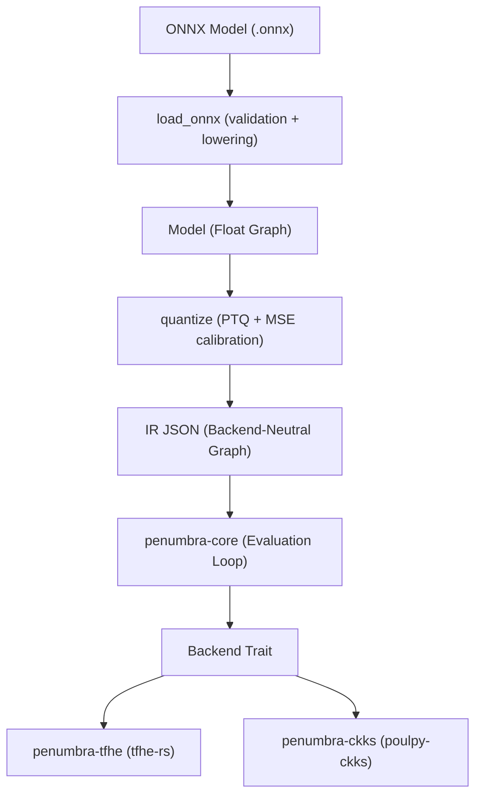

# Architecture

Penumbra-FHE is built around a **three-layer architecture** with **two narrow waists**. The design separates machine learning front-ends from homomorphic encryption backends so that adding a new model never requires cryptographic changes, and adding a new encryption scheme never requires graph or compiler changes.

## System Flow

## The Three Layers

1. **Layer 3: Python Front End (`python/penumbra/`)**
   - **ONNX Ingestion:** Parses computational graphs, validates operators at load time against the supported op registry, and folds batch normalization into convolution parameters.
   - **Quantization Service:** Slices calibration data to perform Post-Training Quantization (PTQ), inserts fused `Requant` operations, and calculates radix budgets.
   - **IR Emission:** Emits the canonical, backend-neutral Intermediate Representation (IR) in JSON wire format.

2. **Layer 2: Core Runtime (`crates/penumbra-core/`)**
   - **Backend-Neutral:** Contains zero cryptography code and zero scheme-specific branches.
   - **IR & Validation:** Deserializes and validates the IR graph structure across languages in lockstep.
   - **Evaluation Loop:** Performs topological ordering (Kahn's algorithm) and orchestrates graph execution, dispatching operations to the `Backend` trait.
   - **Optimization:** Collapses redundant rescale chains and fuses activation lookups.
   - **Profiling:** Measures per-node build and evaluation times alongside backend hardware counters under a unified harness.

3. **Layer 1: Pluggable Backends (`crates/penumbra-tfhe/`, `crates/penumbra-ckks/`)**
   - **`penumbra-tfhe`:** Exact integer arithmetic implemented over [`tfhe-rs`](https://github.com/zama-ai/tfhe-rs). Values are decomposed across shortint radix blocks with carry propagation and Programmable Bootstrapping (PBS) lookup tables.
   - **`penumbra-ckks`:** Approximate real-number arithmetic implemented over [`poulpy-ckks`](https://github.com/phantomzone-org/poulpy). Values are packed into complex polynomial slots, evaluating convolutions and projections as SIMD ring operations without bootstrapping.

## The Two Narrow Waists

A traditional compiler often exposes unbounded surface area. Penumbra-FHE strictly constrains abstraction boundaries in both directions:

- **Waist 1: The Op Vocabulary (~8 operations)**
  All models — whether deep CNNs, multilayer perceptrons, or tree ensembles — compile down to a compact set of ~8 primitive operations: `Linear`, `Conv2d`, `Pool`, `Activation`, `Argmax`, `Compare`, `Requant`, `Add`, `Concat`, and `Split`. A new use case (e.g., facial recognition or fraud detection) adds a new graph, never new cryptography.
- **Waist 2: The `Backend` Trait**
  The evaluation loop interfaces with cryptography exclusively through the `Backend` trait. A new backend (e.g., CKKS) adds a new Layer-1 crate, never edits Layer 2 or the IR. Both backends consume the exact same IR JSON graph and are evaluated under the same harness.

## Architectural References

- **[`PROJECT.md`](https://github.com/Harikeshav-R/Penumbra-FHE/blob/main/PROJECT.md):** The primary architectural rationale, design decisions, and system invariants.
- **[FHE Backends](BACKENDS.md):** Deep-dive into backend boundaries, scheme comparison, and adding backends.
- **[IR Specification](IR-SPEC.md):** Detailed specification of the JSON Intermediate Representation and schema versioning.
